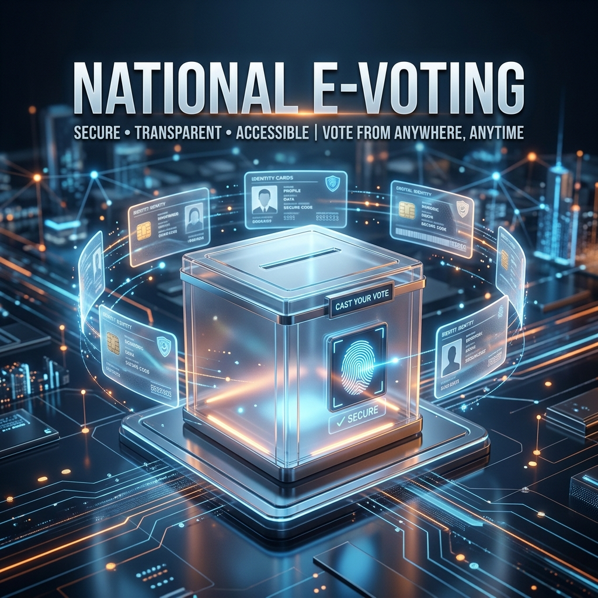

# 🗳️ National e-Voting Portal 2.0



## 🌟 Overview
The **National e-Voting Portal** is a cutting-edge, secure, and transparent digital voting platform designed to revolutionize the democratic process. Built with a focus on **Security**, **Scalability**, and **User Experience**, this system integrates real-world authentication protocols including **Twilio SMS OTP Architecture**, **DigiLocker KYC Verification**, and **Biometric Selfie Checks**.

---

## 🚀 Key Features & 6-Step Security Flow

### 1️⃣ Identity Login & Captcha
- Users initiate the process using a 10-digit mobile number.
- **Bot Protection**: Live alphanumeric Captcha generation to verify human intelligence before executing requests.

### 2️⃣ Mobile OTP Verification
- Cryptographically generated 6-digit passcodes dispatched via **Twilio**.
- **Smart Routing**: Attempts real SMS first, with an automatic fallback to an in-memory simulated OTP if Twilio encounters trial limitations.

### 3️⃣ Central Authority Document Validation
Real-time programmatic cross-referencing of government documents:
- **Aadhaar (UIDAI)**: Authenticated using the **Verhoeff Checksum Algorithm**.
- **PAN Card (IT Dept)**: Strict syntax verification and Entity Type (4th character) extraction.
- **Voter ID/EPIC (ECI)**: Regional and sequential structure mapping.

### 4️⃣ Government KYC Authorization (OTP)
- Following document clearance, a secondary **KYC OTP** is dispatched.
- Ensures the user has control of the mobile/email officially registered with government databases, preventing misuse of stolen document numbers.

### 5️⃣ Live Biometric Verification
- **WebRTC Camera Integration**: Mandatory live selfie capture to log physical presence.
- Enforces an immutable audit trail tying physical identity to the digital vote.

### 6️⃣ Triple-Lock Immutable Voting
- **One-Vote Constraint**: Cryptographic hashes of Aadhaar, PAN, and Voter ID are stored. If *any* of the three documents maps to an existing vote, the transaction is rejected.
- **JWT Protection**: All operations are signed with 15-minute expiring JSON Web Tokens.

---

## 🛠️ Technology Stack

| Layer | Technology | Usage |
|---|---|---|
| **Frontend** |  | State Management & Premium UI |
| **Backend** |  | API Gateway & Logic |
| **Database** |  | Distributed Cluster & Persistence |
| **Auth** |  | Stateless Security Tokens |
| **SMS/Comms** |  | SMS Dispatch Infrastructure |
| **Media** |  | Live Camera & Biometric Feeds |

---

## 🚦 Getting Started

### 1️⃣ Clone the Repository
```bash
git clone https://github.com/Dev-anxit/voting-system.git
cd voting-system
```

### 2️⃣ Configure Environment
Create a `.env` file in the `backend/` directory:
```env
TWILIO_ACCOUNT_SID=your_sid
TWILIO_AUTH_TOKEN=your_token
TWILIO_SMS_NUMBER=your_number
JWT_SECRET_KEY=your_random_long_string
MONGO_URI=your_mongodb_cluster_uri
```

### 3️⃣ Launch the Ecosystem
Run the unified development command from the root:
```bash
npm install
npm run dev
```

The system will automatically boot:
- **Frontend Portal**: `http://localhost:4455`
- **Backend Core**: `http://localhost:4000`

---

## 📂 Project Architecture

```text
├── backend/            # Express.js Server & Security Logic
│   ├── server.js       # Main API & KYC Integrations
│   └── .env            # Private Credentials
├── public/             # Static Assets & Icons
│   ├── logos/          # Party Identity Symbols (SVG)
│   └── assets/         # UI Graphics & Backgrounds
├── index.html          # Portal Entry point
├── app.jsx             # React State & Multi-Step Logic
└── styles.css          # Premium Design System (Vanilla CSS)
```

---

## 📜 Legacy Core (C++)
This project also includes a high-performance **C++ Core** for local desktop voting simulations, utilizing Advanced Data Structures (`std::map`, `std::set`) for O(log n) lookup efficiency.
- Build with: `make`
- Run with: `./voting-system.app/Contents/MacOS/voting-system`

---

## 🤝 Contributing
1. Fork the Project
2. Create your Feature Branch (`git checkout -b feature/AmazingFeature`)
3. Commit your Changes (`git commit -m 'Add some AmazingFeature'`)
4. Push to the Branch (`git push origin feature/AmazingFeature`)
5. Open a Pull Request

---

<p align="center">
  <b>Built with ❤️ for a Digital Democracy.</b><br>
  <i>Secured by National e-Voting Authority Node 001</i>
</p>
